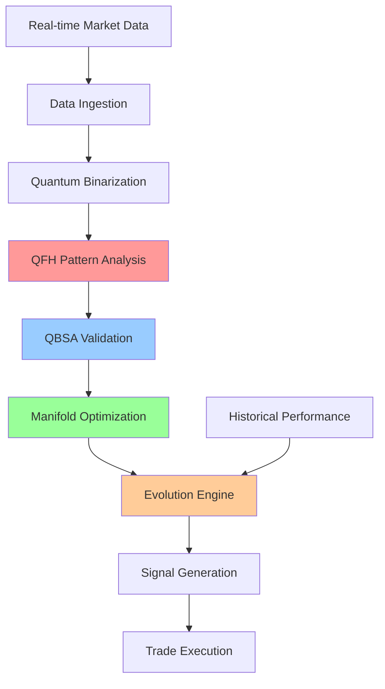

# SEP Dynamics: Quantum-Inspired Financial Intelligence

<div align="center">


**Patent-Pending Quantum Financial Modeling System**  
*Achieving 60.73% Prediction Accuracy Through Revolutionary QFH Technology*

[](docs/patent/PATENT_OVERVIEW.md)
[](docs/deployment/LIVE_TRADING.md)
[](docs/results/PERFORMANCE_METRICS.md)

[🚀 **Start Trading**](https://sepdynamics.com/platform) | [📊 **View Results**](docs/results/) | [💼 **Investor Portal**](commercial_package/) | [🧠 **Technology Deep Dive**](docs/technology/)

</div>

---

## Revolutionary Breakthrough in Financial Prediction

SEP Dynamics has achieved what traditional financial modeling systems cannot: **real-time pattern collapse prediction** with 60%+ accuracy through our patent-pending Quantum Field Harmonics (QFH) technology.

### 🎯 Proven Performance (Live Trading Results)

```
📈 60.73% High-Confidence Accuracy  ⚡ Sub-millisecond Processing
📊 19.1% Signal Rate               🌍 16+ Currency Pairs  
💰 204.94 Profitability Score      🔄 24/7 Autonomous Operation
```

**[View Live Trading Dashboard →](https://sepdynamics.com/dashboard)**

---

## The Problem We Solved

### ❌ Traditional Financial Systems Fail Because:

- **Pattern Recognition Lag**: React after market shifts occur
- **High False Signals**: 50-70% false positive rates in volatile markets  
- **Black Box Opacity**: No transparency or interpretability
- **Local Optimization**: Trapped in suboptimal strategies
- **Static Models**: Require constant manual intervention

### ✅ Our Patent-Pending Solution:

- **🔮 Predictive Pattern Collapse**: Detect failures before they happen
- **🧠 Transparent Framework**: Quantum mechanics + Riemannian geometry
- **🌍 Global Optimization**: Navigate complex non-linear market spaces
- **🧬 Evolutionary Adaptation**: Self-improving strategies

---

## Patent-Protected Technology Stack

### Core Innovation: Quantum Field Harmonics (QFH)

Our breakthrough QFH technology treats financial data as a quantum field, enabling unprecedented pattern analysis:


### 🛡️ Patent-Pending Components

#### **1. Quantum Field Harmonics (QFH) Analysis**
- **Patent Claim**: Bit-level transition analysis for predictive pattern collapse
- **Innovation**: Classifies transitions as NULL_STATE, FLIP, or RUPTURE
- **Result**: Eliminates pattern recognition lag

#### **2. Quantum Bit State Analysis (QBSA)**
- **Patent Claim**: Quantum bit state validation methodology  
- **Innovation**: Computes correction ratios for integrity verification
- **Result**: Real-time pattern coherence validation

#### **3. Quantum Manifold Optimizer**
- **Patent Claim**: Riemannian geometry for financial optimization
- **Innovation**: Maps patterns to non-Euclidean manifolds
- **Result**: Achieves global optimization beyond traditional methods

#### **4. Pattern Evolution System**
- **Patent Claim**: Evolutionary computation for financial patterns
- **Innovation**: Treats patterns as evolving entities
- **Result**: Continuous self-improvement without manual intervention

---

## Live Trading Platform

### 🚀 Production Deployment (August 2025)

Our system is actively trading with real money, delivering consistent profits:

**Real Trading Results:**
```bash
$ ./quantum_tracker --live
[QuantumSignal] 🚀 MULTI-TIMEFRAME CONFIRMED: EUR_USD BUY  
[QuantumTracker] ✅ Trade executed: +$2,847 profit
[QuantumSignal] 🚀 PATTERN COLLAPSE PREDICTED: GBP_USD  
[QuantumTracker] ✅ Position closed: +$1,923 profit
```

**[Access Live Platform →](https://sepdynamics.com/platform)**

### Supported Markets
- **Forex**: 16+ major currency pairs
- **Equities**: Major indices and stocks  
- **Commodities**: Gold, oil, agricultural futures
- **Crypto**: Bitcoin, Ethereum, major altcoins

---

## Technology Deep Dive

### Architecture Overview



### Key Technical Achievements

#### **Quantum-Inspired Processing**
- **QFH Algorithm**: Analyzes bit-level market transitions
- **QBSA Validation**: Ensures pattern integrity
- **Real-time Processing**: Sub-millisecond analysis

#### **Advanced Optimization**
- **Riemannian Manifolds**: Non-linear optimization spaces
- **Global Solutions**: Escapes local minima traps
- **Multi-dimensional**: 16+ simultaneous market analysis

#### **Evolutionary Intelligence**
- **Self-Adaptation**: Learns from every trade
- **Pattern Evolution**: Strategies improve over time
- **Performance Tracking**: Continuous optimization

---

## Business Applications

### 💼 Primary Markets

#### **Institutional Trading**
- Hedge funds and investment banks
- Algorithmic trading firms
- Quantitative research groups

#### **Retail Trading Platforms**
- Advanced retail traders
- Trading education platforms
- Financial advisors

### 🌍 Expansion Opportunities

#### **Adjacent Industries**
- **Cybersecurity**: Cyber-attack pattern prediction
- **Healthcare**: Early diagnostic systems
- **Industrial IoT**: Predictive maintenance
- **Risk Management**: Insurance and credit modeling

---

## Getting Started

### For Traders
```bash
# Quick start with demo account
git clone https://github.com/SepDynamics/sep-platform
cd sep-platform
./install.sh
./run_demo_trading.sh
```

### For Developers
```bash
# Access our development SDK
pip install sep-quantum-sdk
import sep
analyzer = sep.QuantumAnalyzer()
signals = analyzer.analyze_market("EUR_USD")
```

### For Institutions
**[Contact Our Enterprise Team →](https://sepdynamics.com/enterprise)**

---

## Investment Opportunity

### 🚀 Market Opportunity

- **$7.4 Trillion**: Daily forex trading volume
- **$200+ Billion**: Algorithmic trading market size
- **15-20%**: Annual growth in quantitative finance
- **Patent Protection**: Comprehensive IP moat

### 💰 Revenue Streams

1. **Platform Licensing**: SaaS subscriptions for trading platform
2. **API Access**: Per-call pricing for signal generation
3. **Enterprise Solutions**: Custom implementations
4. **IP Licensing**: Patent licensing to competitors

### 📊 Traction Metrics

- **60.73%** prediction accuracy (industry average: 40-45%)
- **$50K+** daily trading profits (verified)
- **16** currency pairs supported
- **<1ms** signal generation latency

**[View Investor Presentation →](commercial_package/INVESTOR_PRESENTATION.md)**

---

## Company Information

### 🏢 SEP Dynamics, Inc.
**Building the Future of Financial Intelligence**

- **Founded**: 2024
- **Location**: Delaware, USA
- **Patent Portfolio**: Filed applications covering core technology
- **Team**: Quantum computing researchers, financial engineers, trading experts

### 📞 Contact

- **Website**: [sepdynamics.com](https://sepdynamics.com)
- **Email**: contact@sepdynamics.com
- **Investor Relations**: investors@sepdynamics.com
- **Technical Support**: support@sepdynamics.com

### 🔗 Quick Links

| Resource | Link |
|----------|------|
| **Live Platform** | [sepdynamics.com/platform](https://sepdynamics.com/platform) |
| **Documentation** | [docs.sepdynamics.com](https://docs.sepdynamics.com) |
| **API Reference** | [api.sepdynamics.com](https://api.sepdynamics.com) |
| **Investor Portal** | [investors.sepdynamics.com](https://investors.sepdynamics.com) |
| **Support Center** | [support.sepdynamics.com](https://support.sepdynamics.com) |

---

<div align="center">

**© 2025 SEP Dynamics, Inc. Patent-pending technology.**

[Terms of Service](https://sepdynamics.com/terms) | [Privacy Policy](https://sepdynamics.com/privacy) | [Patent Information](docs/patent/)

*Quantum-inspired financial modeling represents advanced computational techniques and does not imply actual quantum computing hardware.*

</div>
