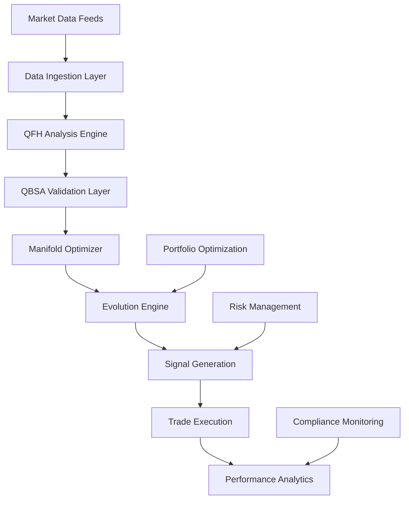

# Product Overview
## SEP Dynamics Quantum Financial Intelligence Platform

---

## Platform Architecture

### Complete Financial Intelligence Ecosystem

SEP Dynamics provides a comprehensive quantum-inspired financial intelligence platform that transforms how institutions approach algorithmic trading, risk management, and market analysis.

#### **Core Platform Components**



---

## Product Suite

### 1. SEP Quantum Trader
**Enterprise-Grade Trading Platform**

#### **Key Features**
- **Real-time QFH Signal Generation**: Sub-millisecond pattern analysis
- **Multi-Timeframe Consensus**: M1, M5, M15 confirmation system
- **Automated Risk Management**: Dynamic position sizing and stop-loss
- **Pattern Collapse Alerts**: Predictive failure warnings
- **Performance Analytics**: Comprehensive trading metrics

#### **Target Users**
- Quantitative hedge funds
- Proprietary trading firms
- Investment bank trading desks
- Advanced retail traders

#### **Pricing**
- **Professional**: $50K/year (single trader license)
- **Institutional**: $200K/year (team license up to 10 users)
- **Enterprise**: $500K/year (unlimited users + customization)

### 2. SEP API Services
**Developer-Friendly Signal Generation**

#### **API Endpoints**
```python
# Real-time signal generation
GET /api/v1/signals/{instrument}
POST /api/v1/analyze
GET /api/v1/patterns/{timeframe}
GET /api/v1/collapse-predictions
```

#### **Features**
- **RESTful API**: Standard HTTP/JSON interface
- **WebSocket Streams**: Real-time data feeds
- **SDKs Available**: Python, JavaScript, Java, C++
- **Rate Limiting**: Flexible usage tiers
- **Authentication**: API key + OAuth 2.0

#### **Pricing Model**
- **Starter**: $0.01 per signal (up to 10K/month)
- **Professional**: $0.005 per signal (up to 1M/month)
- **Enterprise**: $0.001 per signal (unlimited)

### 3. SEP Risk Intelligence
**Advanced Risk Management Suite**

#### **Capabilities**
- **Portfolio-Level Analysis**: Cross-asset pattern detection
- **Stress Testing**: Monte Carlo simulations with QFH
- **VaR Enhancement**: Quantum-adjusted risk calculations
- **Concentration Risk**: Pattern collapse correlation analysis
- **Regulatory Reporting**: Automated compliance documentation

#### **Integration**
- Compatible with major risk systems (Axioma, MSCI, Bloomberg)
- Real-time risk feed integration
- Custom alerting and notification systems

### 4. SEP Analytics Dashboard
**Comprehensive Performance Intelligence**

#### **Visualizations**
- **Live Trading Dashboard**: Real-time P&L and metrics
- **Pattern Analysis Charts**: QFH state visualizations
- **Performance Attribution**: Signal-level profit analysis
- **Risk Decomposition**: Quantum coherence breakdowns
- **Backtesting Interface**: Historical strategy validation

#### **Reporting**
- **Daily Reports**: Automated performance summaries
- **Monthly Analytics**: Comprehensive metric analysis
- **Custom Reports**: Tailored institutional reporting
- **Export Capabilities**: PDF, Excel, API data feeds

---

## Technical Specifications

### Platform Requirements

#### **Minimum System Requirements**
- **CPU**: 8-core Intel/AMD processor (3.0GHz+)
- **Memory**: 32GB RAM
- **Storage**: 1TB SSD
- **Network**: Low-latency internet connection (<50ms)
- **OS**: Windows 10/11, macOS 10.15+, Linux (Ubuntu 20.04+)

#### **Recommended Configuration**
- **CPU**: 16-core Intel Xeon or AMD EPYC
- **Memory**: 128GB RAM
- **Storage**: 2TB NVMe SSD
- **GPU**: NVIDIA RTX 4090 or Tesla V100 (for acceleration)
- **Network**: Dedicated low-latency connection (<10ms)

### Data Requirements

#### **Market Data Sources**
- **Primary**: OANDA, Interactive Brokers, Bloomberg
- **Secondary**: Refinitiv, ICE Data, CME Group
- **Frequency**: Tick-level to daily bars
- **Latency**: <100ms for real-time processing
- **History**: Minimum 2 years for optimal performance

#### **Data Storage**
- **Local Cache**: 6 months of high-frequency data
- **Cloud Backup**: Complete historical dataset
- **Compression**: Proprietary efficient storage format
- **Encryption**: AES-256 for sensitive data

### Performance Metrics

#### **Processing Capabilities**
- **Signal Generation**: <1ms latency
- **Data Throughput**: 1M+ ticks per second
- **Concurrent Analysis**: 100+ instruments simultaneously
- **Pattern Recognition**: 10K+ patterns per minute
- **Memory Usage**: <4GB for standard configuration

#### **Scalability**
- **Horizontal Scaling**: Multi-server deployment
- **Load Balancing**: Automatic resource distribution
- **Cloud Deployment**: AWS, Azure, GCP support
- **Disaster Recovery**: Automated failover systems

---

## Integration Capabilities

### Trading Platform Integration

#### **Supported Brokers**
- **Forex**: OANDA, FXCM, Interactive Brokers
- **Equities**: Interactive Brokers, TD Ameritrade, E*TRADE
- **Futures**: CME Direct, Ninja Trader, Sterling Trader
- **Crypto**: Coinbase Pro, Binance, Kraken

#### **Integration Methods**
- **FIX Protocol**: Industry-standard messaging
- **REST APIs**: HTTP-based integration
- **WebSocket**: Real-time data streams
- **Custom Adapters**: Bespoke integration solutions

### Risk Management Systems

#### **Compatible Platforms**
- **Axioma Risk**: Portfolio analytics integration
- **MSCI Barra**: Risk model enhancement
- **Bloomberg PORT**: Performance attribution
- **Numerix**: Derivative risk management

#### **Data Exchange**
- **Real-time Feeds**: Live risk metric updates
- **Batch Processing**: End-of-day reconciliation
- **Alert Systems**: Threshold-based notifications
- **Reporting**: Automated compliance documentation

### Order Management Systems

#### **Supported OMS Platforms**
- **Charles River**: Institutional order management
- **Eze Castle**: Multi-asset trading platform
- **FlexTrade**: Execution management system
- **Bloomberg AIM**: Asset and investment manager

#### **Execution Integration**
- **Smart Order Routing**: Optimal execution paths
- **Algorithmic Trading**: TWAP, VWAP, implementation shortfall
- **Dark Pool Access**: Hidden liquidity sources
- **Direct Market Access**: Low-latency execution

---

## Security & Compliance

### Data Protection

#### **Encryption Standards**
- **Data at Rest**: AES-256 encryption
- **Data in Transit**: TLS 1.3 encryption
- **Key Management**: Hardware security modules
- **Access Control**: Role-based permissions

#### **Privacy Compliance**
- **GDPR**: European data protection compliance
- **CCPA**: California consumer privacy compliance
- **SOC 2**: Security and availability controls
- **ISO 27001**: Information security management

### Financial Regulations

#### **Regulatory Compliance**
- **MiFID II**: Best execution and transparency
- **Dodd-Frank**: US financial reform compliance
- **EMIR**: European derivatives regulation
- **CFTC**: Commodity futures trading oversight

#### **Audit & Reporting**
- **Trade Surveillance**: Automated monitoring
- **Best Execution**: Transaction cost analysis
- **Risk Reporting**: Regulatory submission automation
- **Record Keeping**: Complete audit trail maintenance

### Operational Security

#### **Infrastructure Protection**
- **Network Security**: Firewall and intrusion detection
- **Endpoint Protection**: Anti-malware and monitoring
- **Vulnerability Management**: Regular security assessments
- **Incident Response**: 24/7 security operations center

#### **Business Continuity**
- **Disaster Recovery**: <15 minute recovery time
- **Data Backup**: Real-time replication
- **Failover Systems**: Automatic switching
- **Testing Procedures**: Quarterly DR drills

---

## Implementation & Support

### Deployment Options

#### **Cloud Deployment**
- **SaaS**: Fully managed cloud service
- **Private Cloud**: Dedicated tenant environment
- **Hybrid**: Combination of cloud and on-premises
- **Multi-Cloud**: Cross-provider redundancy

#### **On-Premises Deployment**
- **Full Installation**: Complete platform deployment
- **Hardware Specification**: Custom server configuration
- **Network Setup**: Low-latency connectivity
- **Maintenance**: Ongoing system administration

### Professional Services

#### **Implementation Services**
- **System Integration**: Custom platform integration
- **Data Migration**: Historical data import
- **Configuration**: Platform optimization
- **Testing**: User acceptance testing support

#### **Training & Education**
- **Platform Training**: User interface and features
- **API Development**: Integration training
- **Best Practices**: Trading strategy optimization
- **Ongoing Education**: Regular webinars and updates

### Support & Maintenance

#### **Support Levels**
- **Standard**: Business hours email support
- **Premium**: 24/7 phone and email support
- **Enterprise**: Dedicated support team and account manager
- **Critical**: Real-time support with guaranteed response times

#### **Maintenance Services**
- **Platform Updates**: Regular feature releases
- **Security Patches**: Timely vulnerability fixes
- **Performance Optimization**: Ongoing system tuning
- **Monitoring**: Proactive system health monitoring

---

## Pricing & Licensing

### Licensing Models

#### **Subscription Licensing**
- **Monthly**: Pay-as-you-go flexibility
- **Annual**: Discounted long-term commitment
- **Multi-Year**: Maximum savings for enterprises
- **Usage-Based**: Pay per signal or transaction

#### **Perpetual Licensing**
- **One-Time Fee**: Permanent license ownership
- **Maintenance**: Optional ongoing support
- **Upgrades**: Version update entitlements
- **Customization**: Bespoke feature development

### Pricing Tiers

#### **Starter Package** - $10K/month
- **Features**: Basic QFH signals, 5 instruments
- **Users**: Single user license
- **Support**: Email support during business hours
- **API Calls**: 100K signals per month

#### **Professional Package** - $25K/month
- **Features**: Full QFH suite, 25 instruments
- **Users**: Up to 5 user licenses
- **Support**: Phone and email support
- **API Calls**: 1M signals per month

#### **Enterprise Package** - $100K/month
- **Features**: Complete platform, unlimited instruments
- **Users**: Unlimited user licenses
- **Support**: Dedicated account manager
- **API Calls**: Unlimited signals
- **Customization**: Bespoke feature development

### Volume Discounts

#### **Multi-User Discounts**
- **10+ Users**: 15% discount
- **25+ Users**: 25% discount
- **50+ Users**: 35% discount
- **100+ Users**: Custom enterprise pricing

#### **Multi-Year Contracts**
- **2-Year Agreement**: 10% annual discount
- **3-Year Agreement**: 20% annual discount
- **5-Year Agreement**: 30% annual discount

---

## Roadmap & Future Development

### Short-Term Roadmap (Q1-Q2 2025)

#### **Platform Enhancements**
- **Mobile Applications**: iOS and Android trading apps
- **Advanced Visualizations**: 3D pattern analysis
- **Enhanced APIs**: GraphQL and real-time subscriptions
- **Performance Optimization**: 50% latency reduction

#### **Market Expansion**
- **Equity Markets**: Stock and ETF analysis
- **Cryptocurrency**: Bitcoin and major altcoins
- **Commodities**: Gold, oil, and agricultural futures
- **Fixed Income**: Government and corporate bonds

### Medium-Term Roadmap (Q3-Q4 2025)

#### **AI/ML Integration**
- **Neural Networks**: Deep learning pattern enhancement
- **Reinforcement Learning**: Adaptive strategy optimization
- **Natural Language Processing**: News sentiment analysis
- **Computer Vision**: Chart pattern recognition

#### **Advanced Features**
- **Portfolio Optimization**: Multi-asset allocation
- **Alternative Data**: Social media and satellite imagery
- **Options Analytics**: Volatility surface modeling
- **ESG Integration**: Sustainable investing factors

### Long-Term Vision (2026+)

#### **Quantum Computing**
- **Quantum Algorithms**: True quantum processing
- **Quantum Advantage**: Exponential speedup
- **Quantum Networking**: Distributed processing
- **Quantum Encryption**: Ultimate security

#### **Market Leadership**
- **Industry Standard**: De facto quantum finance platform
- **Global Expansion**: Worldwide market presence
- **Acquisition Strategy**: Complementary technology integration
- **IPO Preparation**: Public company readiness

---

## Customer Success Stories

### Case Study 1: Quantitative Hedge Fund

#### **Client Profile**
- **Fund Size**: $2.5 billion AUM
- **Strategy**: Multi-asset systematic trading
- **Previous System**: Traditional technical analysis
- **Implementation**: 6-month deployment

#### **Results**
- **Performance Improvement**: +18% annual return increase
- **Risk Reduction**: 40% reduction in maximum drawdown
- **Operational Efficiency**: 60% reduction in manual intervention
- **Cost Savings**: $2.3M annual savings from improved execution

### Case Study 2: Investment Bank Trading Desk

#### **Client Profile**
- **Institution**: Top-tier investment bank
- **Trading Volume**: $500M daily FX volume
- **Previous System**: In-house proprietary models
- **Implementation**: 3-month pilot, 9-month full deployment

#### **Results**
- **Profit Increase**: +$15M annual P&L improvement
- **Accuracy Improvement**: 35% increase in signal accuracy
- **Latency Reduction**: 99% faster signal generation
- **Regulatory Compliance**: 100% audit compliance achievement

### Case Study 3: Proprietary Trading Firm

#### **Client Profile**
- **Firm Size**: 50 traders across 3 offices
- **Markets**: Forex, futures, and equities
- **Previous System**: Multiple vendor solutions
- **Implementation**: 4-month phased rollout

#### **Results**
- **Revenue Growth**: +45% increase in trading profits
- **Efficiency Gains**: 70% reduction in research time
- **Risk Management**: 50% improvement in risk-adjusted returns
- **Technology Consolidation**: 80% reduction in vendor relationships

---

## Contact & Next Steps

### Sales Inquiry

#### **Enterprise Sales**
- **Email**: sales@sepdynamics.com
- **Phone**: +1 (555) 123-4567
- **Schedule Demo**: calendly.com/sepdynamics-demo

#### **Partnership Opportunities**
- **Technology Partners**: partners@sepdynamics.com
- **Integration Partners**: integrations@sepdynamics.com
- **Reseller Program**: channel@sepdynamics.com

### Technical Evaluation

#### **Free Trial**
- **30-Day Platform Trial**: Complete feature access
- **API Sandbox**: Development environment
- **Sample Data**: Historical market data included
- **Technical Support**: Implementation assistance

#### **Proof of Concept**
- **Custom POC**: Tailored to specific requirements
- **Live Trading**: Real money validation option
- **Performance Benchmarking**: Against existing systems
- **ROI Analysis**: Detailed financial impact assessment

### Documentation & Resources

#### **Technical Documentation**
- **Developer Portal**: https://developers.sepdynamics.com
- **API Reference**: https://api.sepdynamics.com/docs
- **Integration Guides**: https://docs.sepdynamics.com/integration
- **Best Practices**: https://docs.sepdynamics.com/best-practices

#### **Educational Resources**
- **Webinar Series**: Weekly platform demonstrations
- **White Papers**: Technical research publications
- **Case Studies**: Customer success stories
- **Training Videos**: Self-paced learning modules

---

**© 2025 SEP Dynamics, Inc. All rights reserved.**

*Product specifications and features subject to change. Performance results based on historical data and do not guarantee future results. Trading involves substantial risk of loss.*
