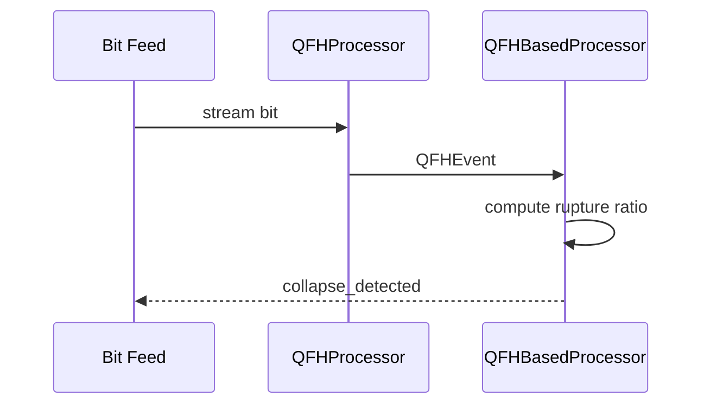
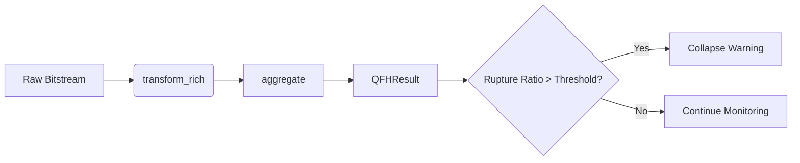

# Innovation Story: Pattern Collapse Prediction

This document outlines how Quantum Field Harmonics (QFH) primitives convert raw bitstreams into forecasts of upcoming market shifts.

## Concept Overview
QFH classifies adjacent bits into quantum-inspired states, enabling an early warning when trading patterns begin to destabilize.

## Visualizing Pattern Collapse
```mermaid
flowchart LR
    A[Bitstream] --> B{Transition\nClassifier (qfh.cpp)}
    B -->|NULL_STATE| C[Stable Field]
    B -->|FLIP| D[Oscillation]
    B -->|RUPTURE| E[Collapse Signal]
    E --> F[Aggregate Ruptures]
    F -->|ratio > threshold| G[Market Shift Forecast]
```



## Implementation Map
- `src/core/qfh.h` – Declares QFH states, event structures, and analysis interfaces.
- `src/core/qfh.cpp` – Implements transition classification, aggregation, and collapse detection used to signal market reversals.
- `src/core/pattern_processor.h` / `.cpp` – Translate damped trajectories into coherence, stability, entropy, and confidence metrics that inform signal quality.


## Primitive Overview
| Primitive | File | Forecasting Role |
|-----------|------|-----------------|
|`QFHState`|`src/core/qfh.h`|Categorizes adjacent bit transitions into `NULL_STATE`, `FLIP`, and `RUPTURE` to flag stable, oscillating, or collapsing fields, forming the foundation of market shift alerts.|
|`QFHEvent`|`src/core/qfh.h`|Captures per-bit context so that patterns of ruptures can be tallied against flips and stability to build early warnings.|
|`QFHAggregateEvent`|`src/core/qfh.h`|Groups sequential events, revealing sustained ruptures that often precede structural breaks in price action.|
|`transform_rich`|`src/core/qfh.cpp`|Converts raw bitstreams into classified events, enabling downstream ratios that hint at impending turbulence.|
|`aggregate`|`src/core/qfh.cpp`|Summarizes event runs; the distribution of grouped ruptures drives collapse thresholds.|
|`QFHProcessor`|`src/core/qfh.cpp`|Streams live bits, updating state on the fly so traders see instability before it matures into a crash.|
|`QFHResult`|`src/core/qfh.h`|Holds event counts, rupture ratios, and entropy metrics used to gauge confidence in predicted market direction.|
|`QFHOptions`|`src/core/qfh.h`|Configurable thresholds that calibrate sensitivity to flips versus ruptures for different asset regimes.|
|`QFHBasedProcessor`|`src/core/qfh.cpp`|Integrates trajectory math and collapse detection, translating bit dynamics into actionable market shift forecasts.|

## Pattern Collapse Prediction


### Bit Transition Illustration
```
Prev: 0 0 1 1 1
Curr: 0 1 1 1 0
State:N F R R F
```
Consecutive `R` entries indicate a rising rupture ratio. When this ratio exceeds the configured threshold, `QFHBasedProcessor` signals a pending pattern collapse, guiding traders to anticipate market reversals.

## Implementation Notes
- Core declarations live in `src/core/qfh.h`, while operational logic is implemented in `src/core/qfh.cpp`.
- These components transform bit-level representations of market data into probabilistic forecasts, empowering the system to detect structural breaks before price charts reveal them.
