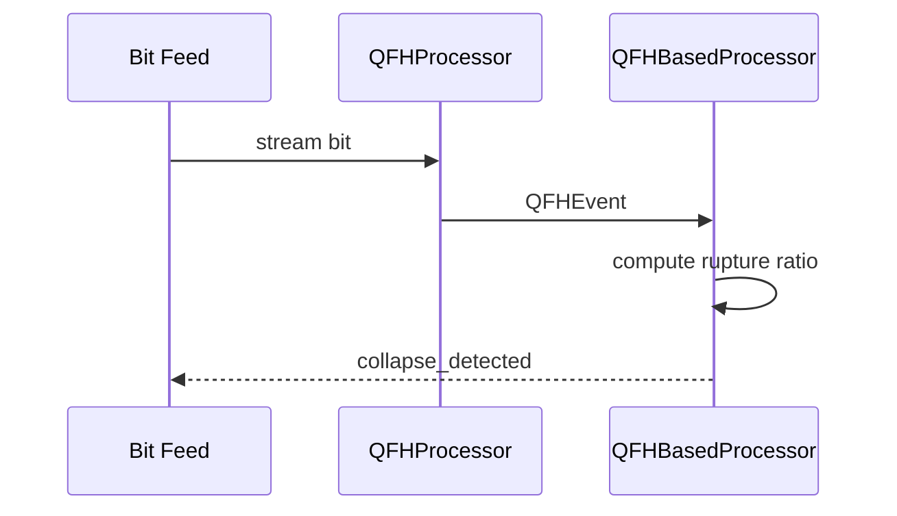

# Innovation Story: Pattern Collapse Prediction

This one-pager outlines how Quantum Field Harmonics (QFH) primitives convert raw bitstreams into forecasts of upcoming market shifts.

## Concept Overview
QFH classifies adjacent bits into quantum-inspired states, enabling early warning when trading patterns begin to destabilize.

## Visualizing Pattern Collapse
```mermaid
flowchart LR
    A[Bitstream] --> B{Transition\nClassifier (qfh.cpp)}
    B -->|NULL_STATE| C[Stable Field]
    B -->|FLIP| D[Oscillation]
    B -->|RUPTURE| E[Collapse Signal]
    E --> F[Aggregate Ruptures]
    F -->|ratio > threshold| G[Market Shift Forecast]
```



## Implementation Map
- `src/quantum/bitspace/qfh.h` – declares QFH states, event structures, and analysis interfaces.
- `src/quantum/bitspace/qfh.cpp` – implements transition classification, aggregation, and collapse detection used to signal market reversals.
- `src/quantum/bitspace/pattern_processor.h` / `.cpp` – translate damped trajectories into coherence, stability, entropy, and confidence metrics that inform signal quality.

Together these components detect pattern collapse and forecast shifts before conventional indicators react.
